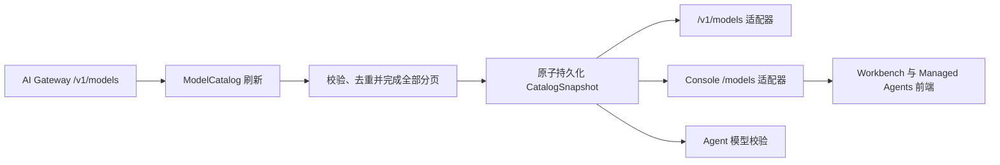

# BYOK 模型目录

## 目标

配置的 AI Gateway 是可选模型 ID 的事实来源。AI Gateway 不可用时，Open Managed Agents 不得生成特定供应商的回退模型目录。

当前上游凭证是安装级配置，因此模型目录同样作用于整套安装。租户级凭证、供应商路由和成本核算属于独立能力；未来可以在不改变消费者接口的前提下增加目录作用域。

## 领域合同

`ModelCatalog` 负责模型发现、校验、发布和目录新鲜度。`CatalogSnapshot` 只包含一次完整的 AI Gateway 返回结果。`Model Selection` 必须显式产生：来源只能是 `model_catalog.default_model_id` 或用户选择，目录顺序不能作为默认选择规则。

模型 ID 是不透明字符串。目录只校验 ID 非空且可稳定持久化，不根据其拼写推断供应商、能力或价格层级。



## 刷新与失败语义

刷新任务必须拉取全部上游分页后才能发布。任意分页失败、响应格式错误、游标重复或模型记录非法，都会拒绝整次新结果，并保留最近一次成功快照。

| 状态 | `/v1/models` | Console `/models` | 新建或更新 Agent |
| --- | --- | --- | --- |
| 新鲜快照 | 返回当前快照 | 返回模型与新鲜度元数据 | 接受快照内的 ID |
| 过期快照 | 返回最近一次成功快照 | 返回模型并标记 `stale: true` | 接受过期快照内的 ID |
| 从未成功同步 | 返回 `503` 目录不可用 | 返回 `503` 目录不可用 | 返回 `503` 目录不可用 |
| 未知 ID | 不适用 | 不适用 | 返回 `400` 模型选择无效 |

每次刷新会记录尝试时间和安全的失败分类，但不会持久化上游凭证、请求 URL 查询参数、响应正文或原始传输错误。

完整分页成功后返回零个模型属于有效的权威快照。该快照必须替换旧目录，确保已经从 AI Gateway 下线的模型不再可选；只有请求失败、响应非法或分页不完整时才保留旧快照并标记为过期。

## 持久化

`model_catalog_snapshots` 当前保存一条安装级记录，其中包含最近一次成功的结构化模型列表、`last_attempt_at`、`last_success_at` 和脱敏后的 `last_error`。成功刷新通过一次 upsert 同时更新模型列表和时间戳；失败刷新只更新时间和错误元数据，不修改最近一次成功列表。

这里有意采用快照，而不是为每个模型单独建行。消费者需要读取一致的完整列表，快照可以避免在分页过程中或部分失败时暴露混合状态。未来增加目录作用域时，可以扩展 catalog key，而不需要修改公开读取接口。

## API 适配器

`/v1/models` 保持 Anthropic 兼容的列表结构，并映射目录字段，但不会虚构 AI Gateway 未声明的能力。Console `/models` 将同一目录适配为 Workbench 所需结构，并向前端提供目录新鲜度元数据。两个读取接口都不会直接请求 AI Gateway。

Managed Agents 的创建和更新路径通过目录校验提交的模型 ID。既有 Agent Version 和 Session Snapshot 保持原样读取；它们是历史引用，不是新的模型选择。

## 客户端行为

Workbench、模板和 Quickstart 在展示模型选项前读取 Console 模型目录。模板不携带固定模型。Quickstart 使用用户选择的模型发起请求，并根据当前目录生成 `build_agent_config` 的模型 schema。未配置有效默认模型时，界面必须要求用户选择，不能自动选择目录第一项。

只有 AI Gateway 明确返回的能力字段才会透传。未知能力在前端按保守方式展示，不根据模型名称推断。

## 配置

模型目录复用 `anthropic_upstream.base_url` 和 `anthropic_upstream.api_key`，确保模型发现与模型请求使用同一个 AI Gateway 凭证边界。目录自身配置如下：

```yaml
model_catalog:
  refresh_interval: 5m
  refresh_timeout: 15s
  default_model_id: ""
```

`default_model_id` 是可选项。只有成功快照中包含完全相同的不透明 ID 时，该值才会作为默认模型暴露给消费者。
