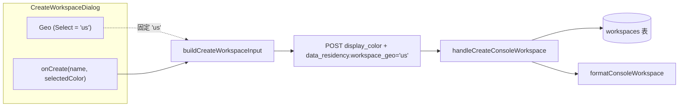

# Create Workspace 对话框 Workspace geo 修复

## 背景

`CreateWorkspaceDialog`（`web/src/shared/workspaces/CreateWorkspaceDialog.tsx`）是控制台创建 workspace 的弹窗。其中 **Workspace geo** 字段被实现为一个写死值的只读输入框，用户无法交互，呈现为“点不动”的文本框；而文案 `workspace.geoHelp` 写着“创建后不可更改”，暗示创建时应可选，与只读实现相矛盾。

## 根因

原实现：

```tsx
<Input id="workspace-geo" value="US" readOnly aria-readonly="true" />
```

字段值硬编码为 `"US"` 且 `readOnly`。

后端现状（`internal/admin/domain_workspace.go: validateDataResidency`）：

- 对 `workspace_geo` 只做 `TrimSpace` + 空值回退 `"us"`，**不校验枚举值**。
- 全系统默认值均为 `"us"`（`defaultDataResidency`、`defaultWorkspace`、`buildCreateWorkspaceInput`）。

即：当前基础设施只支持 US，但字段以误导性的只读文本框呈现。

## 修复决策

将只读 `Input` 替换为 shadcn `Select`（Base UI）：

```tsx
<Select defaultValue="us" items={[{ value: 'us', label: 'US' }]}>
  <SelectTrigger id="workspace-geo" className="w-full">
    <SelectValue>US</SelectValue>
  </SelectTrigger>
  <SelectContent alignItemWithTrigger={false}>
    <SelectItem value="us" label="US">
      US
    </SelectItem>
  </SelectContent>
</Select>
```

- 下拉可正常展开，符合“地域选择器”的语义预期，不再是点不动的死框。
- 当前唯一选项 `US`，诚实反映“目前只有 US 地域”。
- 值仍固定为 `'us'`，`onCreate` 签名与 `buildCreateWorkspaceInput` **不变**，提交负载与后端契约保持一致。

## 数据流



本次改动只触及 Dialog 内的 geo 控件，`onCreate` 之后的所有链路与后端契约均未改变。

## 兼容性

- **后端 API 契约不变**：请求体仍包含 `display_color` 与 `data_residency.workspace_geo`（值 `'us'`），响应仍由 `formatConsoleWorkspace` 序列化。
- **前端公共接口不变**：`CreateWorkspaceDialog` 的 props、`onCreate(name, displayColor)` 签名、`buildCreateWorkspaceInput` 行为均不变，`ConsoleLayout` 与 `WorkspacesSettingsPage` 调用方无需改动。
- **Geo 枚举**：后端本身不限制 `workspace_geo` 取值；前端目前仅暴露 `US`，未来扩展地域只需在 `Select` 的 `items` 增加选项，并视情况让 `onCreate` 透传所选 geo。

## 测试路径

- 手动：在 `http://127.0.0.1:5173` 打开 Create Workspace 弹窗——Workspace geo 下拉可展开，显示 `US`；创建后 geo 落库为 `us`。
- 自动化：`ConsoleLayout.test.tsx`、`WorkspacesSettingsPage.test.tsx` 覆盖创建流程；后端 `workspace_geo` 持久化由 `tests/` 下 console workspace 用例覆盖。

## 相关文件

- `web/src/shared/workspaces/CreateWorkspaceDialog.tsx`（本次改动）
- `web/src/shared/workspaces/presentation.ts`（`buildCreateWorkspaceInput`，未改动）
- `internal/admin/domain_workspace.go`（`validateDataResidency`，未改动）
- `internal/platformapi/console_api_keys.go`（`handleCreateConsoleWorkspace` / `formatConsoleWorkspace`，未改动）
